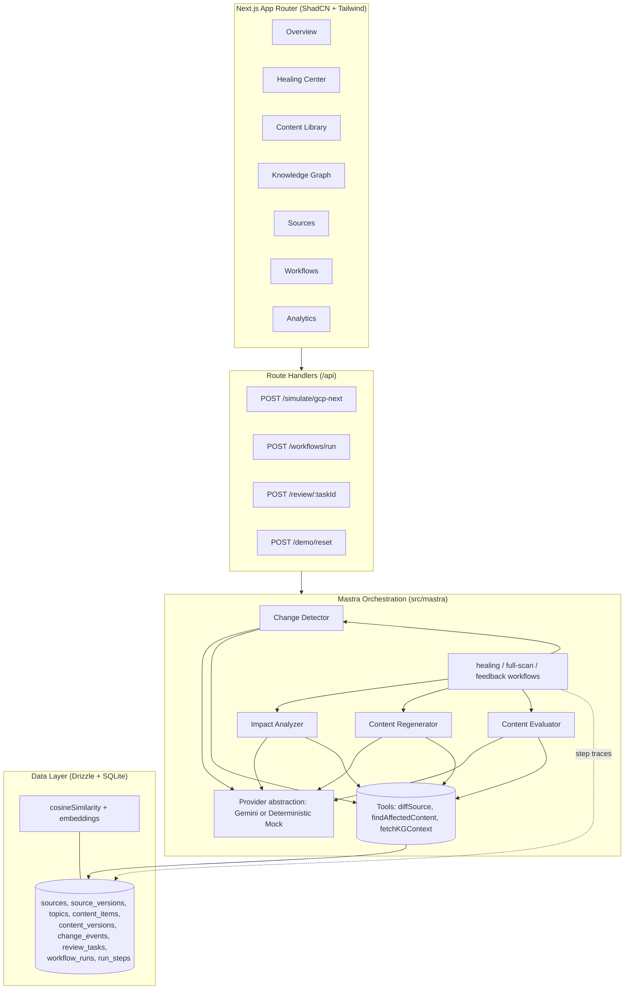
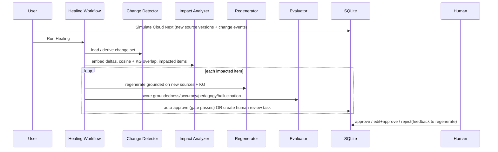
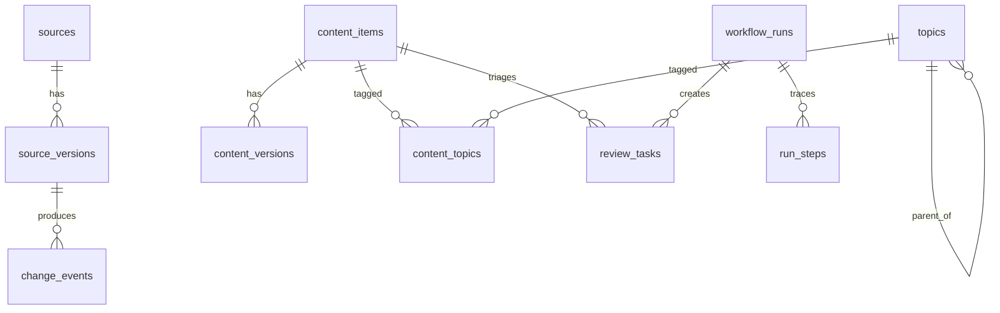

# ContentGuardian 🛡️

**An auto-healing platform that keeps generated certification content accurate as source materials evolve — with human-in-the-loop governance.**

ContentGuardian maintains a library of practice questions, rationales, and lessons for the **Google Cloud Professional Cloud Architect (PCA)** certification. When the underlying sources change (a Google Cloud Next wave: new services, deprecations, exam-guide revisions, emphasis shifts), the system **detects** the change, **analyzes** which content is now stale, **regenerates** grounded proposals, **evaluates** them with an LLM-as-judge, and routes them through an **approval workflow** — auto-approving high-confidence mechanical fixes and escalating substantive rewrites to a human. Every change carries full provenance and an observable agent reasoning trace.

> **Runs with zero configuration.** `npm install && npm run db:seed && npm run dev` works immediately — no database server, no API keys. See [The mock-provider strategy](#-the-mock-provider-strategy).

---

## ✨ Highlights

- **End-to-end agentic healing pipeline** — four composable Mastra agents (Change Detector → Impact Analyzer → Content Regenerator → Content Evaluator) orchestrated into detect → triage → regenerate → evaluate → review.
- **Human-in-the-loop governance** — auto-approve gate (LLM rubric **+** deterministic guardrails **+** a change-type policy); every task shows a plain-language **"Why human review is required"** banner, so a high-scoring item held for editorial review never reads as contradictory. Reject-with-feedback triggers a regeneration loop.
- **Full observability** — every agent call is persisted as a step trace, visible in the UI.
- **Complete provenance** — every content version records the source versions, knowledge-graph snapshot, and agent context that produced it.
- **Polished dashboard** — 7 screens: Overview, Healing Center, Content Library, Knowledge Graph, Sources, Workflows, Analytics.
- **Reproducible 2-minute demo** with a one-click **Reset Demo**.

---

## 🚀 Quick start

```bash
npm install
npm run db:seed     # creates ./contentguardian.db and seeds the PCA library
npm run dev         # http://localhost:3000
```

No `.env` required. To use **live Gemini** instead of the deterministic mock, copy `.env.example` to `.env` and set `GOOGLE_GENERATIVE_AI_API_KEY` (get one at <https://aistudio.google.com/apikey>), then re-seed.

| Script | Purpose |
| --- | --- |
| `npm run db:seed` | Reset DB to the initial seeded PCA library |
| `npm run dev` | Start the Next.js dev server |
| `npm run build` | Production build |
| `npm test` | Unit + integration tests (Vitest) |
| `npm run db:studio` | Browse the DB with Drizzle Studio |

---

## ⏱️ The 2-minute demo

1. **Overview** — the library starts 100% fresh (14 items across the PCA domains).
2. Click **Simulate Cloud Next Update** (top bar). This inserts a **v2** of the exam guide and architecture docs and runs change detection across **six changes**: a **Deployment Manager → Infrastructure Manager deprecation**, a **new generative-AI emphasis** (Gemini, RAG, grounding), a **deepened reliability/SRE emphasis** (error-budget policy, burn-rate alerting), and a **framework rename**. The five affected content items are marked **stale**.
3. Click **Run Healing**. The pipeline regenerates and evaluates the stale items and triages them into **3 auto-approved + 2 human-review**:
   - The **IaC question**, **IaC lesson**, and **framework-rename lesson** are mechanical fixes (`deprecation` / `wording`) that clear the auto-approve gate and go **live automatically**.
   - The **GenAI lesson** and **SRE lesson** are substantive scope changes (`addition` / `emphasis`) → routed to **human review** by the governance policy (see below), even when their confidence is high.
4. Open **Healing Center** → a human-review proposal. Inspect the **side-by-side diff**, the **4 evaluator scores**, and the full **agent reasoning trace**. Then **Approve**, **Edit & Approve**, or **Reject & Regenerate** (your feedback is fed back to the regenerator).
5. Open **Content Library → the healed item** to see the new version, the diff, and the **Provenance** panel (source versions + KG snapshot + agent context).
6. Click **Reset Demo** anytime to return to the initial state.

---

## 🏗️ Architecture



### Healing flow (source change → fresh content)



### Data model (ERD)



`content_versions` carries the **provenance chain**: `source_version_ids`, `kg_snapshot`, and `agent_context`. The live version is pinned by `content_items.current_version_id`; approving a proposal flips the pointer and supersedes the prior version (full history retained).

---

## 🤖 Agents & workflows

| Agent | Model tier | Output (Zod) | Role |
| --- | --- | --- | --- |
| **Change Detector** | flash | `ChangeSet` | Classify source deltas (deprecation/addition/emphasis/wording) with severity + affected topics |
| **Impact Analyzer** | flash | `ImpactReport` | Fuse embedding similarity + KG topic overlap to flag stale items |
| **Content Regenerator** | pro | `ProposedQuestion`/`ProposedLesson` | Produce grounded updates with change notes + citations |
| **Content Evaluator** | flash | `Evaluation` | LLM-as-judge: groundedness, accuracy, pedagogy, hallucination risk |

**Workflows** (orchestrators in `src/mastra/workflows`, each persisting a step trace):

- **healing** — detect → impact → regenerate → evaluate → triage on a source change.
- **full-scan** — the same pipeline run across the whole library on demand.
- **feedback-loop** — re-run regeneration + evaluation with reviewer feedback after a rejection.

**Auto-approve gate** (`src/mastra/scoring.ts` + `config.ts`): a proposal is published automatically only if **all** of the following hold; otherwise it routes to a human:

1. The evaluator clears every dimension floor (groundedness ≥ 0.85, accuracy ≥ 0.85, **pedagogy ≥ 0.85**, hallucination ≤ 0.15).
2. Deterministic structural guardrails pass (valid answer index, citations present, sufficient length).
3. **Governance policy:** the triggering change is *mechanical*. Substantive scope changes — those the Change Detector classifies as `addition` or `emphasis` (new curriculum scope) — always require human sign-off, because publishing new scope is an editorial decision. Mechanical `deprecation` / `wording` fixes may auto-approve. This makes the auto-vs-human mix a function of the **kind of change** the agents detected, not a hardcoded item list — so it behaves identically in mock and live mode (e.g., in live mode a GenAI rewrite can score 0.99 and still, correctly, be held for review).

---

## 🧩 The mock-provider strategy

ContentGuardian runs in one of two modes, chosen **automatically at runtime**:

| Condition | Mode | Behavior |
| --- | --- | --- |
| `GOOGLE_GENERATIVE_AI_API_KEY` **set** | **Real** | Agents call live Gemini via the Vercel AI SDK inside Mastra; embeddings use `gemini-embedding-001`. |
| **No key** (default) | **Mock** | A deterministic, scripted provider drives the **exact same** workflow, persistence, and trace code paths; embeddings use feature hashing. |

The mock (`src/mastra/mock/scenario.ts`) hard-codes a realistic Google Cloud Next scenario and **always returns schema-valid output**, so the pipeline behaves identically with or without a key. Marquee items get hand-authored, high-quality proposals; others get a templated rewrite — yielding a realistic mix of auto-approved and human-review outcomes. Embeddings in mock mode are deterministic per item, so impact analysis is fully reproducible.

> **This is a demo convenience, not a production pattern.** It exists so reviewers can run the entire experience with zero setup. In production you would always run with a real provider key (and likely a managed model gateway).

---

## 🗄️ Database strategy (local SQLite ⇄ production Supabase/Postgres)

ContentGuardian runs on **SQLite locally** and **Supabase (Postgres + pgvector) in production**, selected automatically — additively, with zero change to the local flow.

**Selection.** The client factory (`src/db/client.ts`) reads `DATABASE_URL`:
- starts with `postgres://` / `postgresql://` → **Postgres** (postgres-js) using `schema.pg.ts`;
- otherwise (default) → **SQLite** (better-sqlite3) using `schema.ts` — the zero-config local path.

The rest of the app imports `{ db, schema, dialect }` and never branches on the database.

**Why the data layer is `async`.** `better-sqlite3` is synchronous; every Vercel-compatible Postgres driver is asynchronous. To serve both behind one query layer, `src/db/queries.ts` is async. This changes only internal signatures — the local developer experience (commands, SQLite, zero config) is unchanged. The sync/async gap is absorbed by `rows/row/run` adapters in `src/db/exec.ts`.

**What differs between dialects, and how it's bridged** (all in `src/db/exec.ts`):
| Concern | SQLite | Postgres | Bridge |
| --- | --- | --- | --- |
| Execution | sync `.all/.get/.run` | awaited builder | `rows` / `row` / `run` |
| JSON columns | `text` (strings) | `jsonb` (objects) | `encodeJson` / `decodeJson` |
| Embeddings | `text` (JSON) + TS `cosineSimilarity` | `vector(1536)` (pgvector, native `<=>`-capable) | `toDbEmbedding` / `fromDbEmbedding` |
| Timestamps | `strftime` ISO text | ISO text via `to_char(...)` | identical ISO strings |

Embeddings are pinned to a single `EMBEDDING_DIM = 1536` (mock hashing + Gemini `outputDimensionality`) so the pgvector column is fixed-dimension and mock/real vectors are interchangeable.

**Schema duplication is intentional (short-term).** `schema.ts` (SQLite) and `schema.pg.ts` (Postgres) are kept separate to avoid disturbing the proven local path; table/column names match exactly so `queries.ts` is dialect-agnostic. A future consolidation (e.g. a dialect-parameterized builder, or drizzle `text({mode:'json'})`) is possible once the dual path is battle-tested.

> ⚠️ **Switching SQLite → Supabase requires a re-seed** (`npm run db:seed`). Embeddings live in a different storage and vector space and are not portable between the two.

See **[Deploying to Vercel + Supabase](#-deploying-to-vercel--supabase)** for setup.

---

## 🧠 Architecture decisions

- **Drizzle, dual-dialect: SQLite locally, Supabase/Postgres in production.** Enables true zero-config local dev (`npm run dev`, no services) while being one env var away from a stateful serverless deployment. Implemented via the client factory + exec adapters above — the query layer (`src/db/queries.ts`) is written once. In production, embeddings are real **pgvector** `vector` columns (indexable, native `<=>`); the fused impact *scoring* keeps TS `cosineSimilarity` in both dialects (it blends topic-overlap + severity, not a single kNN), and a `<=>` kNN prefilter is a drop-in for very large libraries.
- **Mastra for orchestration.** It is TypeScript-native and gives first-class agents, tools, structured output (Zod), model routing, and observability with far less glue than hand-rolling AI SDK calls. The workflow orchestrators compose Mastra agents and persist their own step traces for full explainability in the UI.
- **Gemini via the Vercel AI SDK.** Strong structured-output support; cheap `gemini-2.5-flash` for detect/impact/judge and `gemini-2.5-pro` for regeneration. Because Gemini rejects function-calling + a JSON response schema in one request, structured output uses a separate structuring pass (`src/mastra/llm.ts`). A retry/repair pass plus deterministic guardrails handle occasional malformed output.
- **Deterministic mock fallback.** Documented above — a demo-only convenience.

---

## 📁 Project structure

```
src/
  app/                 # App Router pages + /api route handlers
  components/          # ShadCN UI + dashboard widgets, diff/trace/provenance views
  db/
    schema.ts          # SQLite schema (the data model)
    schema.pg.ts       # Postgres mirror (jsonb + pgvector) for Supabase
    client.ts          # dialect-selecting client factory ({ db, schema, dialect })
    exec.ts            # sync/async + json + embedding dialect adapters
    queries.ts         # typed, async, dialect-agnostic query layer
    seed-data.ts       # static PCA content + the simulated Cloud Next change
    seed.ts / reset.ts # idempotent seeding (both dialects)
  lib/                 # embeddings (cosineSimilarity), providers (mock|gemini), formatting
  mastra/
    agents/            # the 4 agents
    tools/             # Mastra tools
    workflows/         # healing, full-scan, feedback, simulate orchestrators
    mock/scenario.ts   # deterministic Cloud Next scenario
    scoring.ts         # guardrails + auto-approve gate
    schemas.ts         # Zod output contracts
drizzle/               # generated migrations
```

---

## 🧪 Testing

```bash
npm test
```

Vitest runs unit tests (cosine similarity, deterministic embeddings, guardrails + auto-approve gate) and an end-to-end **integration test** of the healing engine against an isolated `./.test.db` in mock mode — asserting the full simulate → heal → reject-feedback → approve flow, including auto-approve vs human-review triage and trace persistence.

---

## ▲ Deploying to Vercel + Supabase

Vercel's filesystem is ephemeral, so production uses Supabase Postgres (with pgvector) instead of SQLite. The app already supports this — you only provide connection strings.

**1. Create a Supabase project** (free tier is fine). The `vector` extension is created automatically by the first migration (`CREATE EXTENSION IF NOT EXISTS vector;`), or you can enable it under *Database → Extensions*.

**2. Grab two connection strings** (Supabase → *Project Settings → Database*):
- **Transaction pooler** (port **6543**, `?pgbouncer=true`) → `DATABASE_URL` (runtime; serverless-friendly).
- **Direct** (port **5432**) → `DIRECT_URL` (migrations only).

**3. Run migrations + seed against Supabase** (locally, once):
```bash
export DATABASE_URL="postgresql://…:6543/postgres?pgbouncer=true"
export DIRECT_URL="postgresql://…:5432/postgres"
export GOOGLE_GENERATIVE_AI_API_KEY="…"   # production should use real Gemini
npm run db:migrate:pg   # applies drizzle/postgres/* (creates the vector extension)
npm run db:seed         # seeds Supabase (detects Postgres from DATABASE_URL)
```

**4. Deploy to Vercel.** Import the repo and set Environment Variables:
| Variable | Value |
| --- | --- |
| `DATABASE_URL` | Supabase **pooler** URL (port 6543, `?pgbouncer=true`) |
| `DIRECT_URL` | Supabase **direct** URL (port 5432) |
| `GOOGLE_GENERATIVE_AI_API_KEY` | your Gemini key |

`next build` runs as-is. `better-sqlite3`, `postgres`, and `@mastra/core` are declared in `serverExternalPackages`. postgres-js is initialized with `prepare: false` because the Supabase transaction pooler (pgBouncer) doesn't support prepared statements, and `max: 1` to keep the serverless connection footprint small.

> The same code runs locally on SQLite with **no** `DATABASE_URL` set — nothing about local development changes.

---

## 🔌 Extending

- **New content types** — add to the `ContentType` union, the body discriminator in `src/lib/content-types.ts`, and a regenerator schema.
- **New agents/tools** — drop a module in `src/mastra/agents` or `tools` and register it in `src/mastra/index.ts`.
- **Tune the policy** — thresholds live in `src/mastra/config.ts`.
- **New sources** — extend `SEED_SOURCES` / `SEED_SOURCE_CHANGES` in `src/db/seed-data.ts`.

---

## 🧰 Tech stack

TypeScript (strict) · Next.js 16 (App Router) · React 19 · Tailwind CSS v4 · ShadCN UI · Drizzle ORM + SQLite (better-sqlite3) · Mastra · Vercel AI SDK + Google Gemini · Recharts · Vitest.
